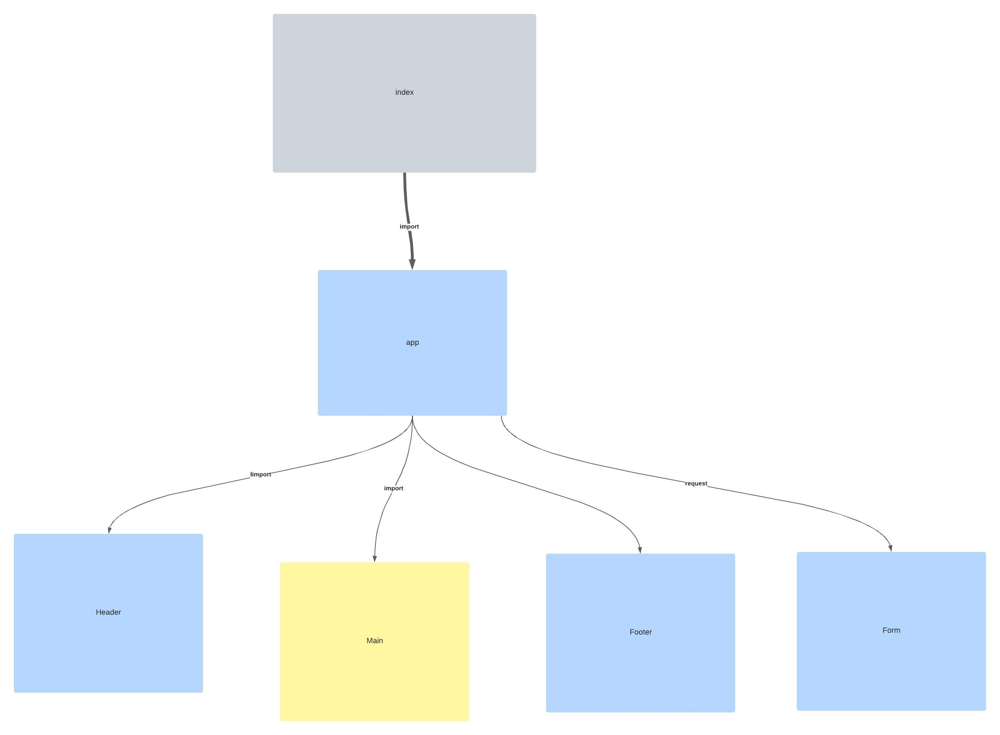

# Getting Started with Create React App

This project was bootstrapped with [Create React App](https://github.com/facebook/create-react-app).

Begin with creating your application using create-react-app

Write an App component that serves as the container for all sub-components of this application

The app should import an .scss file to serve as the base design for the site
Import and render Header, Footer, and Form components from other files using
ES6 import syntax

The `<Header>` component should use it’s own .scss file for styling
The `<Footer>` component should use it’s own .scss file for styling

The` <Form>` component should:
    Use it’s own .scss file for styling
    Accept user input for a URL and store it in state
    Allow the user to choose a method and store it in state

User enters an API URL

    Chooses a REST Method
    Clicks the “Go” button
    Application fetches data from the URL given, with the method specified
    Displays the response headers and results separately
    Both headers and results should be “pretty printed” JSON

[liveSite](https://festive-austin-87cd14.netlify.app/)